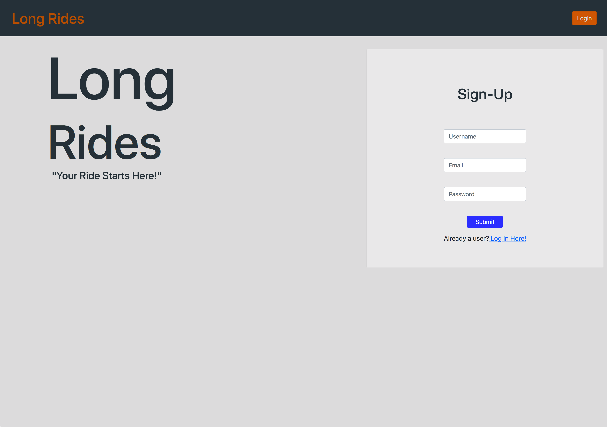
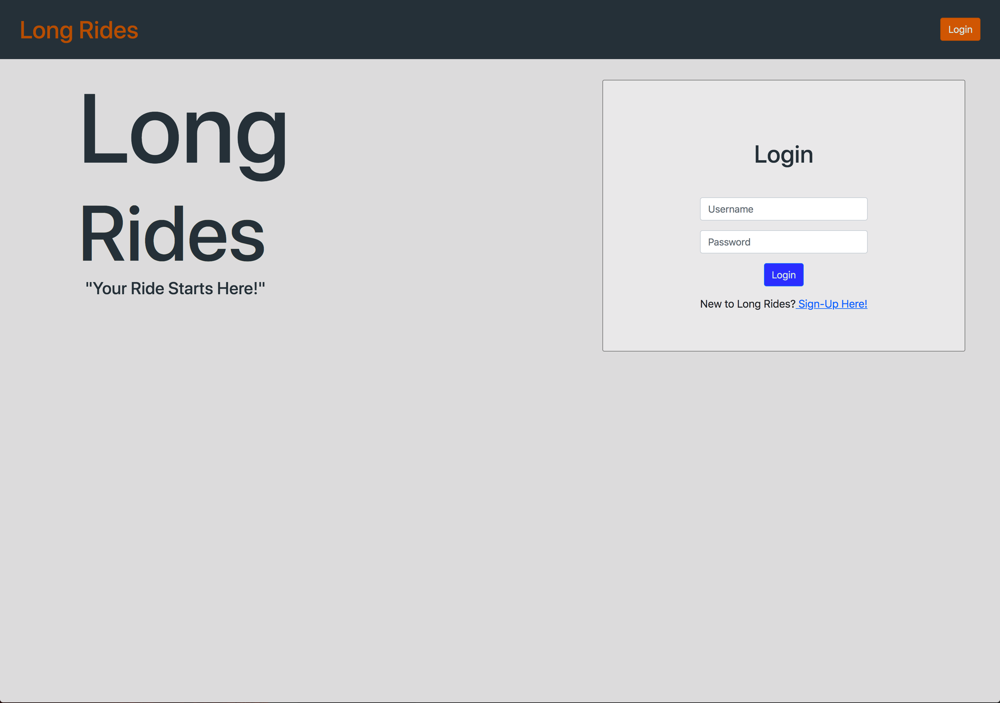
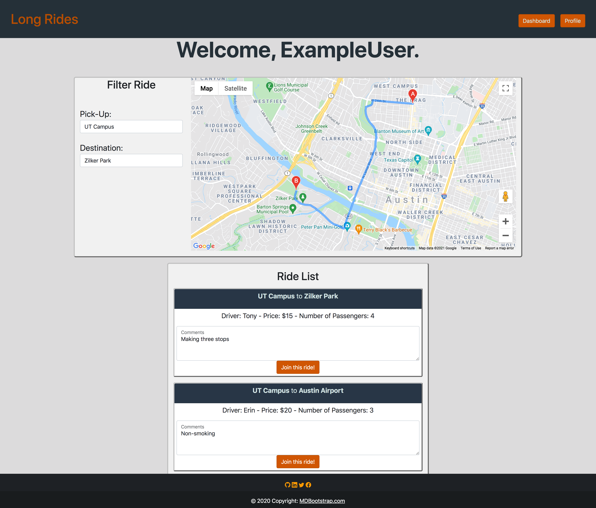
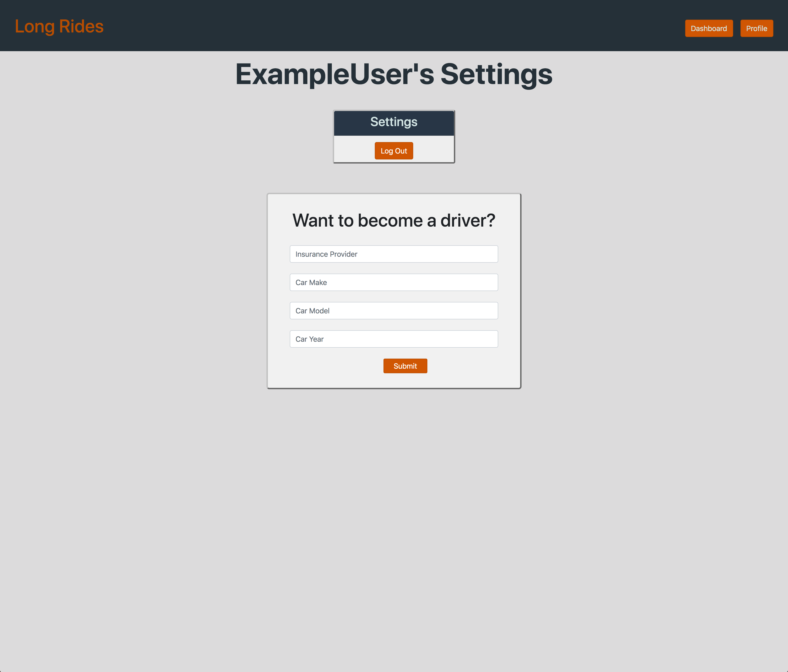
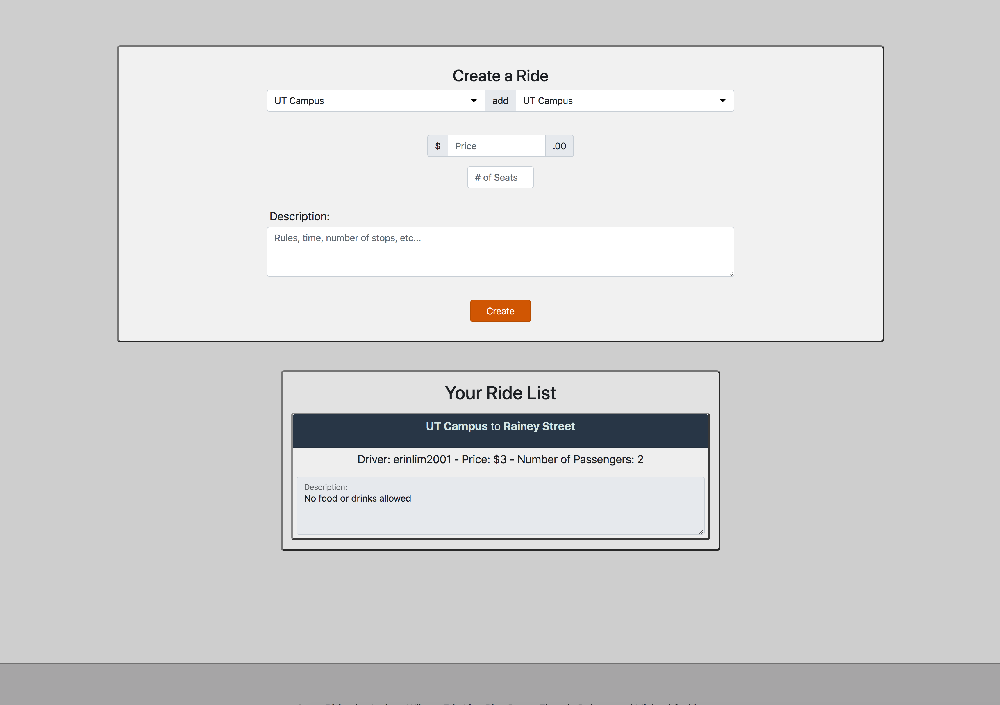

# Project_2

## The Goal
Long Rides is an application that allows UT students to have an affordable and convenient rideshare system. Students are able to receive rides from other students who create driver profiles. These drivers can customize their pick-up and destination locations, prices, and can give a brief description of the ride (number of stops, rules). This allows students to be able to make money while giving others rides and other students to have a cheaper alterntive to pricey ride share apps like Uber, Lyft, and Hitch.

## How it's Made
Long Rides was built using Handlebars, CSS, NodeJS, Express.JS, MySQL, Sequelize ORM, and Javascript. With combined use, we were able to construct a functional and convenient website where UT students can get rides and create rides for others. Using a Google Maps API, we were able to display a map of rides from different pick up points and destinations. Long Rides is an application free to use by any UT Austin Students.
## The History and Future for Long Rides
This project was built by Andrew Wilson, Erin Lim, Rico Perez, Einstein Dalmau, and Michael Leeser for a coding assignment. We hope to add additional features that allow drivers to create rides from any pick up and destination points and not preset locations that we currently have. We also hope to create a section where students can create posts asking for specific rides on specific dates so drivers who are going to the same location can create a ride.

## Come Visit Us!
You can reach Long Rides through the following URL: https://long-rides.herokuapp.com/

## Installation 
1. Clone the repository using "git clone" followed by the SSH key or HTTPS 
2. It will contain various js files, a README.md, css files, and handlebars files.

## Usage
You will be able to view the website on a desktop web browser once it is deployed.

Desktop Screen:

## License 
MIT License

Copyright (c) 2021 Andrew Wilson

Permission is hereby granted, free of charge, to any person obtaining a copy
of this software and associated documentation files (the "Software"), to deal
in the Software without restriction, including without limitation the rights
to use, copy, modify, merge, publish, distribute, sublicense, and/or sell
copies of the Software, and to permit persons to whom the Software is
furnished to do so, subject to the following conditions:

The above copyright notice and this permission notice shall be included in all
copies or substantial portions of the Software.

THE SOFTWARE IS PROVIDED "AS IS", WITHOUT WARRANTY OF ANY KIND, EXPRESS OR
IMPLIED, INCLUDING BUT NOT LIMITED TO THE WARRANTIES OF MERCHANTABILITY,
FITNESS FOR A PARTICULAR PURPOSE AND NONINFRINGEMENT. IN NO EVENT SHALL THE
AUTHORS OR COPYRIGHT HOLDERS BE LIABLE FOR ANY CLAIM, DAMAGES OR OTHER
LIABILITY, WHETHER IN AN ACTION OF CONTRACT, TORT OR OTHERWISE, ARISING FROM,
OUT OF OR IN CONNECTION WITH THE SOFTWARE OR THE USE OR OTHER DEALINGS IN THE
SOFTWARE.